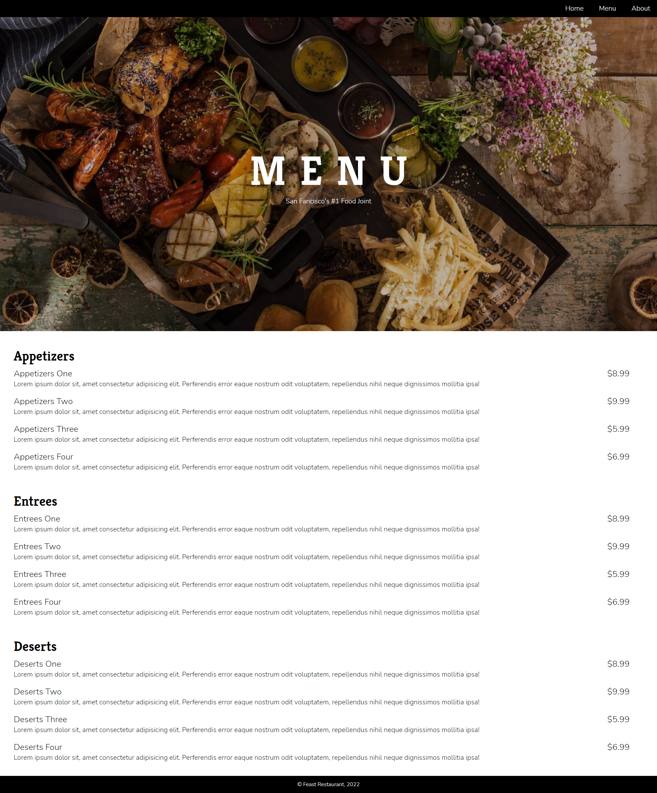

# Sample Restaurant Website
Simple restaurant website with Home, Menu and About pages.

## Description
- Home Page: Displays information about the restaurant and why they are special.
- Menu Page: Displays food item, description and price.
- About Page: Displays information about history, staff and address.

## Deployment
The webpage is deployed to GitHub pages. Use below link to visit the webpage: https://nileshpatel83.github.io/PracticeProject1/index.html

## Home Page

## Menu Page

## About Page

## License
Please refer to the LICENSE in the repo.